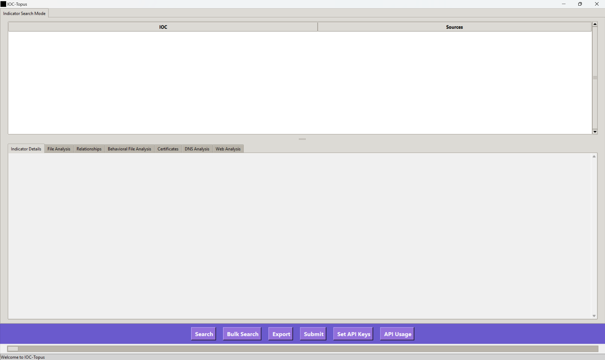
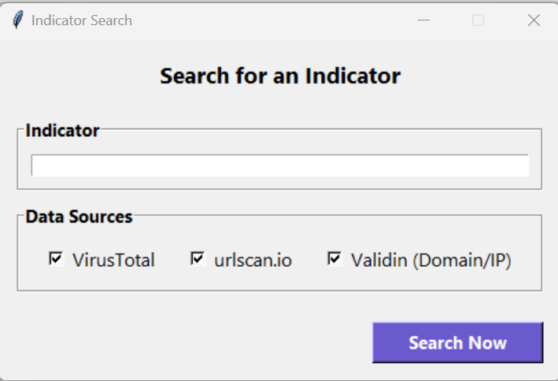
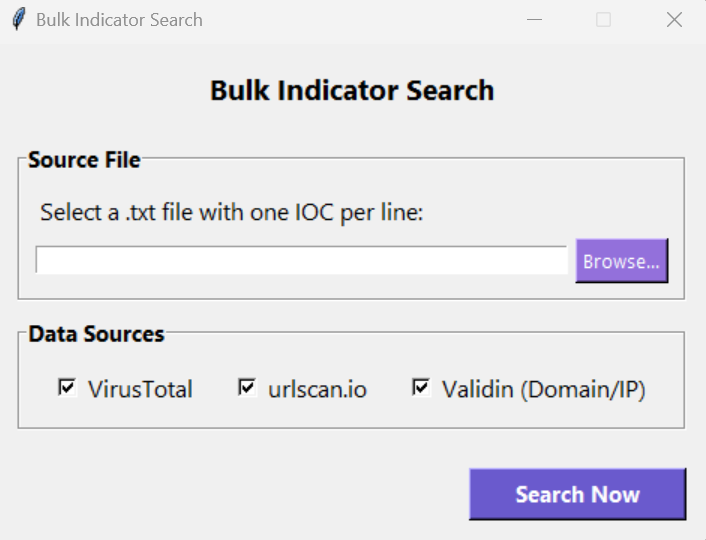
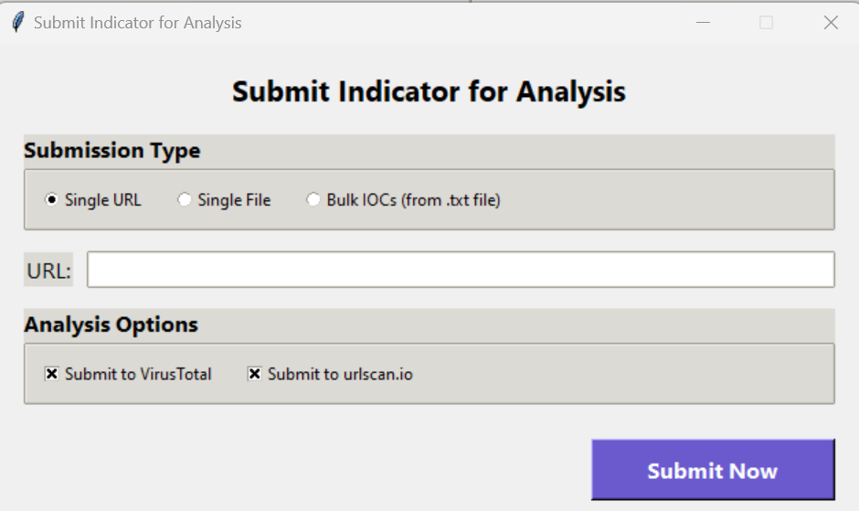
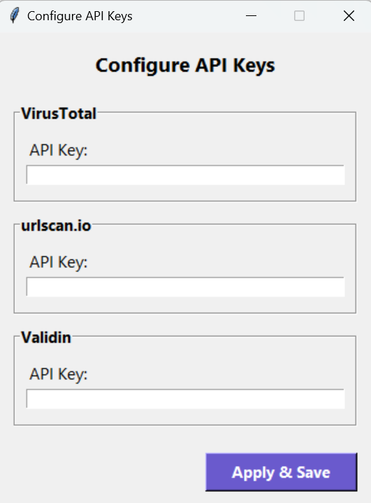
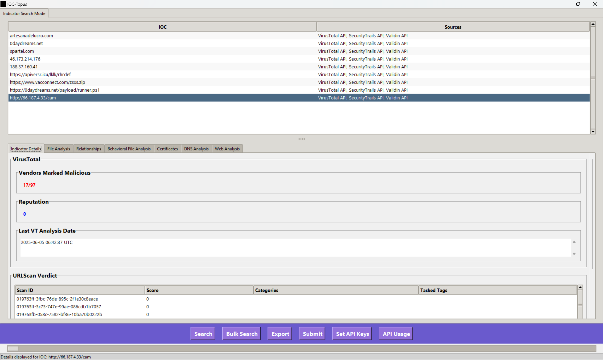
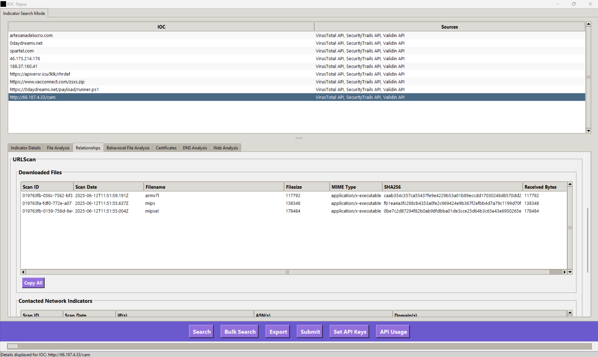
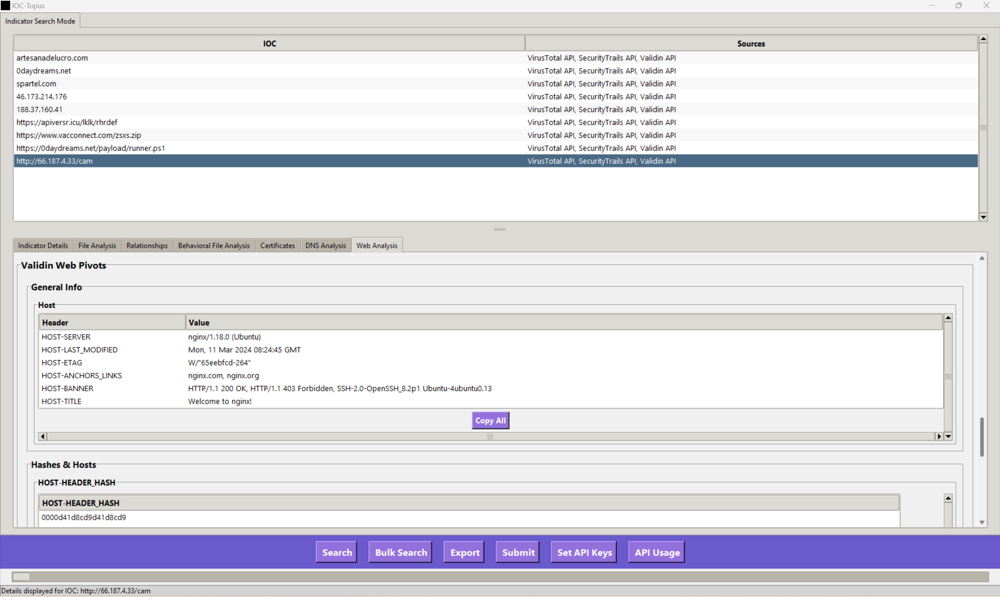

# 🐙 IOCTopus - Your Threat Intelligence Swiss Army Knife

**Tired of juggling a dozen browser tabs for IOC analysis? IOCTopus is a fast, powerful, GUI-based threat intelligence aggregator that brings the data to you.**

IOCTopus streamlines your workflow by fetching, correlating, and displaying rich data for Indicators of Compromise (IPs, domains, URLs, and file hashes) from the most trusted APIs in threat intelligence.

---

### ✨ Project Vision: From Analysis to Hunting

IOCTopus is designed with a two-phase mission.

1.  **IOC Search Mode (Current)**: To provide a best-in-class tool for rapidly enriching and analyzing known indicators. The intelligence gathered here is the crucial first step.
2.  **Infrastructure Hunting Mode (Future)**: To use the data from IOC analysis as a launchpad for proactive hunting. The ultimate goal is to empower researchers to pivot from a single indicator to discovering an adversary's entire operational infrastructure.

This tool aims to shorten the lifecycle from incident response to threat hunting.

---

### 🖼️ Screenshots

A quick look at the IOCTopus interface.

**Main Window & IOC Search**




**Search View**




**Bulk Search View**




**Submit View**




**Configuring API Keys**




**Indicator Details Results**




**Relationships Results**




**Web Analysis Results**




---

### Key Features

-   **All-in-One Interface**: Look up IOCs from VirusTotal, urlscan.io, and Validin without leaving the application.
-   **Bulk Analysis**: Feed it a list of IOCs and let it do the hard work, with results neatly organized for review.
-   **Secure API Key Storage**: Your API keys are **encrypted at rest** on your local machine using a master key, so they are never stored in plaintext.
-   **Submit & Detonate**: Submit URLs and files for fresh analysis and sandboxing on VirusTotal and urlscan.io.
-   **Rich, Correlated Data**: View detailed file attributes, network communication, behavioral analysis, and submitted URLs in easy-to-navigate tabs.
-   **Export to CSV**: Easily export all collected data for reporting or further analysis in other tools.

---

### 🛡️ Secure by Design: API Key Encryption

When you enter your API keys into IOCTopus:
1.  A master encryption key is generated and stored securely in your user home directory (`~/.ioc_topus_key`).
2.  Your API keys are encrypted using this master key.
3.  The **encrypted keys** are saved to a local `.env` file.
4.  At runtime, the application decrypts the keys into memory for use.

**Your API keys are never stored in plaintext on your disk.**


---

### Installation & Usage

IOCTopus is packaged for easy installation. Using a virtual environment is strongly recommended.

1.  **Clone the repository:**
    ```bash
    git clone [https://github.com/scoope3/ioc-topus.git](https://github.com/scoope3/ioc-topus.git)
    cd ioc-topus
    ```

2.  **Create and activate a virtual environment:**
    ```bash
    # Create the environment
    python -m venv venv

    # Activate it (on Windows)
    .\venv\Scripts\activate

    # Activate it (on macOS/Linux)
    # source venv/bin/activate
    ```

3.  **Install the project:**
    This single command installs IOCTopus and all of its dependencies in editable mode.
    ```bash
    python -m pip install -e .
    ```

4.  **Run the application:**
    Now you can run the app using the simple command-line script.
    ```bash
    ioc-topus gui
    ```

5.  **Set Your API Keys:**
    -   On first launch, click the **"Set API Keys"** button.
    -   Enter your keys for VirusTotal, urlscan.io, and Validin.
    -   Click **"Apply"**. Your keys will be encrypted and saved for future sessions.


6.  **Start Analyzing!**
    -   Use the **Search** or **Bulk Search** buttons to look up indicators.
    -   Use the **Submit** button to send new URLs or files for analysis.
    -   Use the **Export** widget to export your search results.
    -   Click on any IOC in the top results list to see detailed, categorized data in the tabs below.

---

### 🚀 Development and Acknowledgements

This project's development was significantly accelerated with the assistance of **Google's Gemini**. Its capabilities in code generation, debugging complex errors (like circular imports), and strategic planning were instrumental in building IOCTopus.

For a detailed view of upcoming features and long-term goals, please see the [**Project Roadmap**](ROADMAP.md).

---
*Disclaimer: This tool is provided for educational and research purposes only. The user is responsible for adhering to the terms of service of all integrated API providers.*
